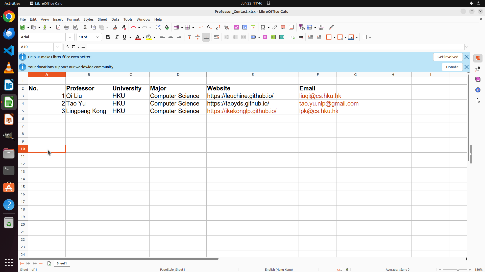

# I am collecting the contact information of some professors and have their homepage links listed here…

[← Multi-app Workflows](../README.md) · [← Showcase](../../README.md)

## Task

> I am collecting the contact information of some professors and have their homepage links listed here. Assist me in completing the form by adding their respective email addresses.

## Final state

## Artifacts

- [Trajectory](traj.jsonl) — per-step actions, reasoning, and screenshots
- [Runtime log](runtime.log)
- [Task definition](task.json) — original OSWorld task config
- Step screenshots: `step_*.png` in this folder

Task ID: `c7c1e4c3-9e92-4eba-a4b8-689953975ea4` · Domain: `multi_apps`
