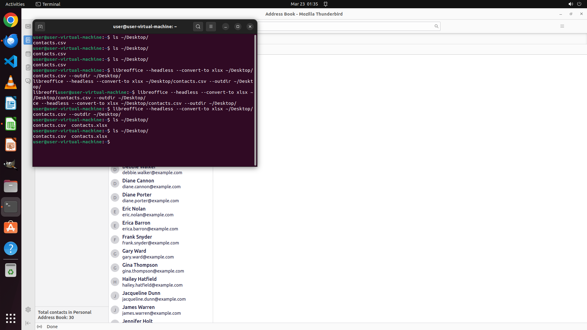

# Please assist me in exporting my contacts of Personal Address Book from Thunderbird into contacts.cs…

[← Multi-app Workflows](../README.md) · [← Showcase](../../README.md)

## Task

> Please assist me in exporting my contacts of Personal Address Book from Thunderbird into contacts.csv file in the desktop and convert it to .xlsx with Libreoffice Calc.

## Final state

## Artifacts

- [▶ Screen recording](recording.mp4) — full agent run
- [Trajectory](traj.jsonl) — per-step actions, reasoning, and screenshots
- [Runtime log](runtime.log)
- [Task definition](task.json) — original OSWorld task config
- Step screenshots: `step_*.png` in this folder

Task ID: `c867c42d-a52d-4a24-8ae3-f75d256b5618` · Domain: `multi_apps` · Source: `https://www.sync.blue/en/sync/mozilla-thunderbird/google-sheets/`
