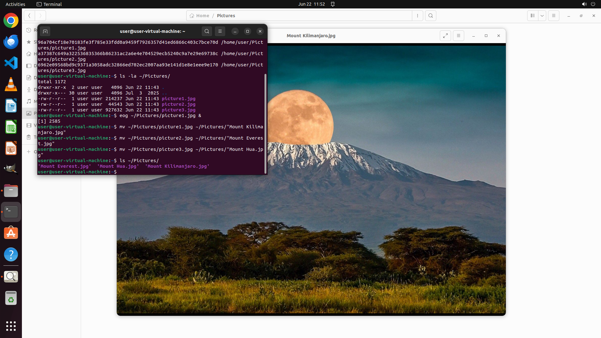

# There are several pictures of mountains in my Pictures directory, but I don’t know the names of thes…

[← Multi-app Workflows](../README.md) · [← Showcase](../../README.md)

## Task

> There are several pictures of mountains in my Pictures directory, but I don’t know the names of these mountains. Please help me identify these pictures and change the names of these pictures to the names of the mountains in the pictures.

## Final state

## Artifacts

- [Trajectory](traj.jsonl) — per-step actions, reasoning, and screenshots
- [Runtime log](runtime.log)
- [Task definition](task.json) — original OSWorld task config
- Step screenshots: `step_*.png` in this folder

Task ID: `ce2b64a2-ddc1-4f91-8c7d-a88be7121aac` · Domain: `multi_apps` · Source: `authors`
