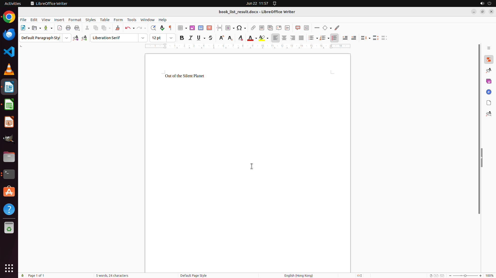

# Examine the spreadsheet on the desktop, which contains a record of books read in 2022. Take the webs…

[← Multi-app Workflows](../README.md) · [← Showcase](../../README.md)

## Task

> Examine the spreadsheet on the desktop, which contains a record of books read in 2022. Take the website https://howlongtoread.com/ as a reference to identify the book with the slowest reading pace, measured in words per day. I have an empty document named 'book_list_result.docx' on the desktop; please open it and record the title there.

## Final state

## Artifacts

- [Trajectory](traj.jsonl) — per-step actions, reasoning, and screenshots
- [Runtime log](runtime.log)
- [Task definition](task.json) — original OSWorld task config
- Step screenshots: `step_*.png` in this folder

Task ID: `da52d699-e8d2-4dc5-9191-a2199e0b6a9b` · Domain: `multi_apps` · Source: `GAIA`
