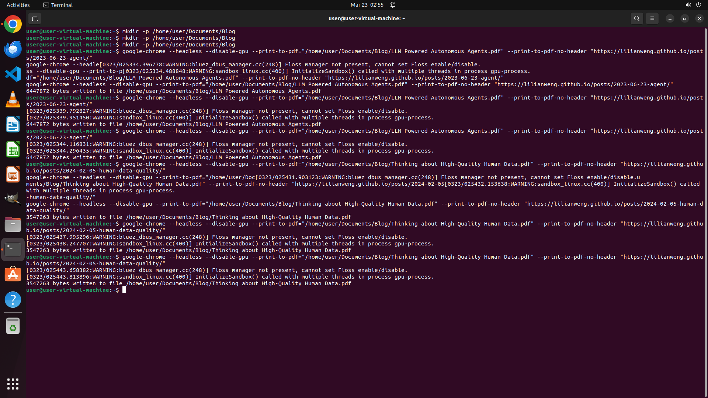

# I browsed a lot of interesting blog articles today. I hope to store these articles in my local desig…

[← Multi-app Workflows](../README.md) · [← Showcase](../../README.md)

## Task

> I browsed a lot of interesting blog articles today. I hope to store these articles in my local designated folder just like zotero stores papers. Please download the blogs opening now in pdf format and save them in their title to /home/user/Documents/Blog.

## Final state

## Artifacts

- [▶ Screen recording](recording.mp4) — full agent run
- [Trajectory](traj.jsonl) — per-step actions, reasoning, and screenshots
- [Runtime log](runtime.log)
- [Task definition](task.json) — original OSWorld task config
- Step screenshots: `step_*.png` in this folder

Task ID: `da922383-bfa4-4cd3-bbad-6bebab3d7742` · Domain: `multi_apps` · Source: `authors`
