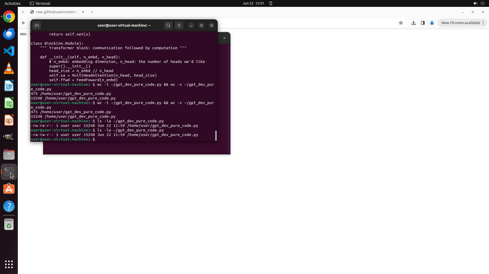

# Please extract all Python code and comments from Karpathy's GPT colab code cells (skip markdown part…

[← Multi-app Workflows](../README.md) · [← Showcase](../../README.md)

## Task

> Please extract all Python code and comments from Karpathy's GPT colab code cells (skip markdown parts), merge into "gpt_dev_pure_code.py" in Home directory. Include all Python code and # comments from code cells, but exclude markdown docstrings and file headers.

## Final state

## Artifacts

- [Trajectory](traj.jsonl) — per-step actions, reasoning, and screenshots
- [Runtime log](runtime.log)
- [Task definition](task.json) — original OSWorld task config
- Step screenshots: `step_*.png` in this folder

Task ID: `dd60633f-2c72-42ba-8547-6f2c8cb0fdb0` · Domain: `multi_apps` · Source: `authors`
