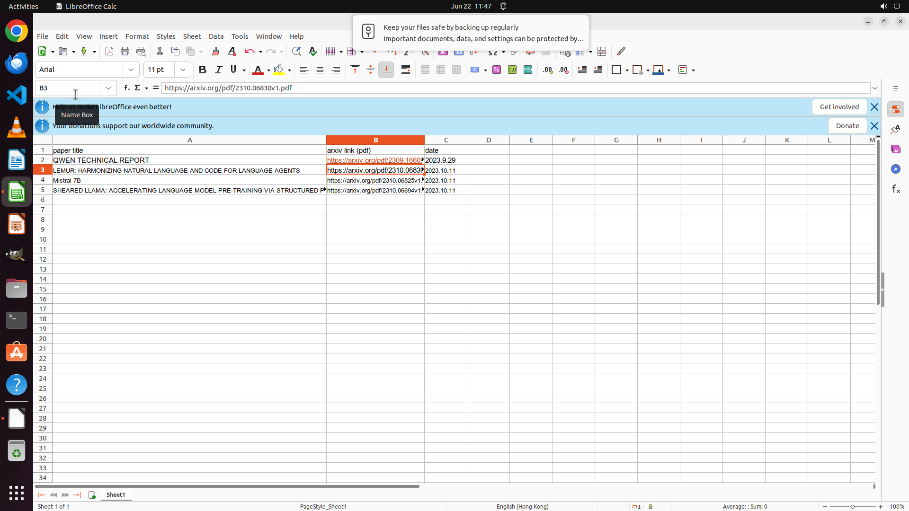

# Find a paper list of all the new foundation language models issued on 11st Oct. 2023 via arxiv daily…

[← Multi-app Workflows](../README.md) · [← Showcase](../../README.md)

## Task

> Find a paper list of all the new foundation language models issued on 11st Oct. 2023 via arxiv daily, and organize it into the sheet I opened.

## Final state

## Artifacts

- [Trajectory](traj.jsonl) — per-step actions, reasoning, and screenshots
- [Runtime log](runtime.log)
- [Task definition](task.json) — original OSWorld task config
- Step screenshots: `step_*.png` in this folder

Task ID: `deec51c9-3b1e-4b9e-993c-4776f20e8bb2` · Domain: `multi_apps` · Source: `authors`
