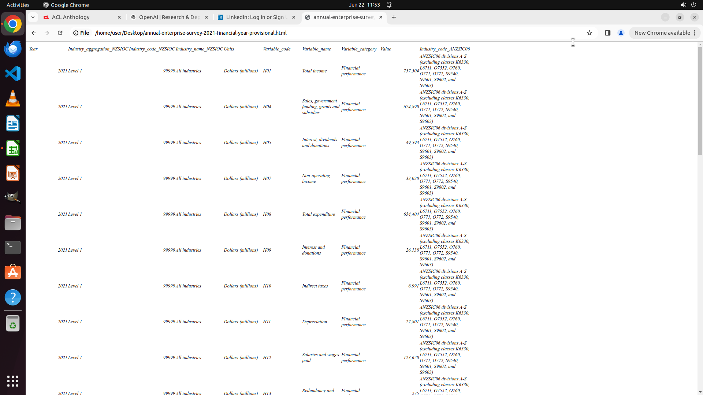

# Please convert a .xlsx file opened in LibreOffice Calc to a .html file and view it in Chrome.

[← Multi-app Workflows](../README.md) · [← Showcase](../../README.md)

## Task

> Please convert a .xlsx file opened in LibreOffice Calc to a .html file and view it in Chrome.

## Final state

## Artifacts

- [Trajectory](traj.jsonl) — per-step actions, reasoning, and screenshots
- [Runtime log](runtime.log)
- [Task definition](task.json) — original OSWorld task config
- Step screenshots: `step_*.png` in this folder

Task ID: `e135df7c-7687-4ac0-a5f0-76b74438b53e` · Domain: `multi_apps` · Source: `https://www.ilovefreesoftware.com/23/featured/free-csv-to-html-converter-software-windows.html`
