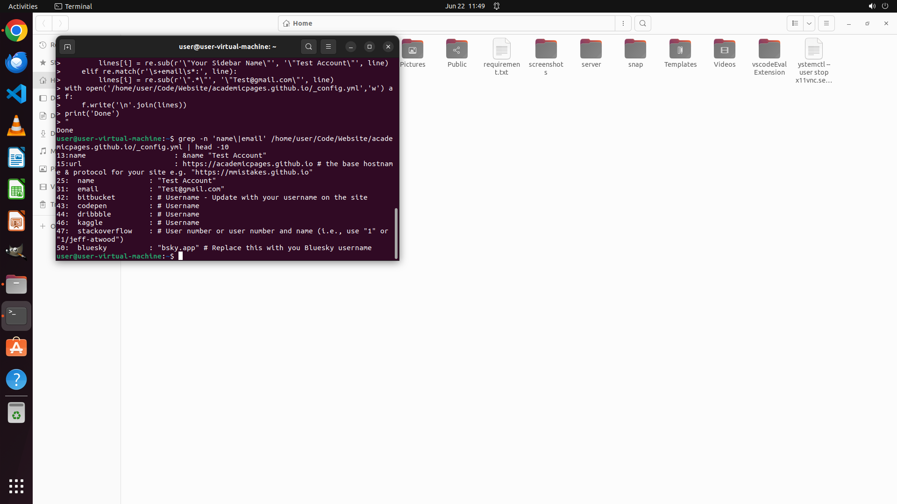

# I recently started using the famous personal academic homepage template from academicpages.github.io…

[← Multi-app Workflows](../README.md) · [← Showcase](../../README.md)

## Task

> I recently started using the famous personal academic homepage template from academicpages.github.io to build my own personal homepage, and I have cloned it to my local ~/Code/Website folder. According to an online tutorial, I can configure my name and contact information in the _config.yaml file. However, I am not familiar with the YAML file format. Please help me find the sections related to the name and contact information in this file and change them to "Test Account" and "Test@gmail.com".

## Final state

## Artifacts

- [Trajectory](traj.jsonl) — per-step actions, reasoning, and screenshots
- [Runtime log](runtime.log)
- [Task definition](task.json) — original OSWorld task config
- Step screenshots: `step_*.png` in this folder

Task ID: `e2392362-125e-4f76-a2ee-524b183a3412` · Domain: `multi_apps` · Source: `authors`
