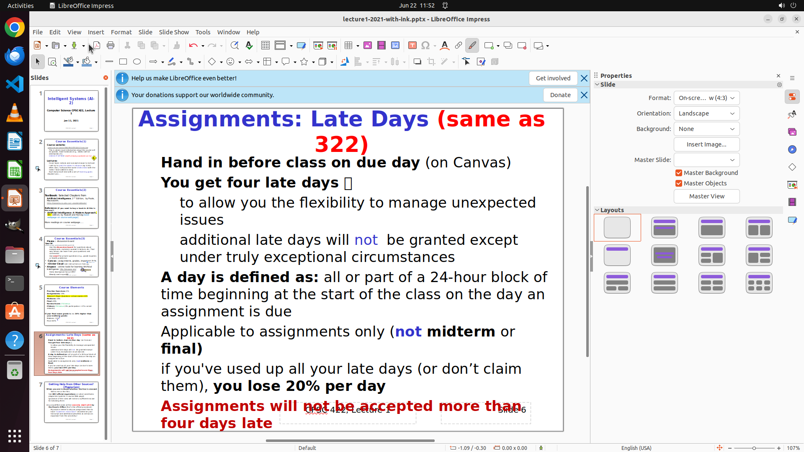

# Tomorrow, I'm scheduled to deliver a talk, and my PowerPoint slides and speaking notes are saved on …

[← Multi-app Workflows](../README.md) · [← Showcase](../../README.md)

## Task

> Tomorrow, I'm scheduled to deliver a talk, and my PowerPoint slides and speaking notes are saved on the desktop. Help me insert my planned remarks for each slide into the "note" section of the PowerPoint as a reminder. I've completed this task for some slides; assist me in completing the remaining part.

## Final state

## Artifacts

- [Trajectory](traj.jsonl) — per-step actions, reasoning, and screenshots
- [Runtime log](runtime.log)
- [Task definition](task.json) — original OSWorld task config
- Step screenshots: `step_*.png` in this folder

Task ID: `eb303e01-261e-4972-8c07-c9b4e7a4922a` · Domain: `multi_apps` · Source: `authors`
