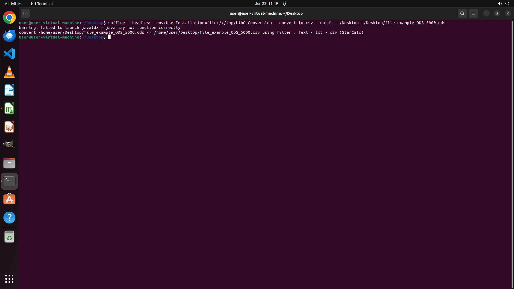

# Could you help me convert the opened ods file in the desktop to csv file with the same file name usi…

[← Multi-app Workflows](../README.md) · [← Showcase](../../README.md)

## Task

> Could you help me convert the opened ods file in the desktop to csv file with the same file name using command line when Libreoffice instance is running?

## Final state

## Artifacts

- [Trajectory](traj.jsonl) — per-step actions, reasoning, and screenshots
- [Runtime log](runtime.log)
- [Task definition](task.json) — original OSWorld task config
- Step screenshots: `step_*.png` in this folder

Task ID: `ee9a3c83-f437-4879-8918-be5efbb9fac7` · Domain: `multi_apps` · Source: `https://stackoverflow.com/questions/64589140/convert-ods-to-csv-using-command-line-when-libreoffice-instance-is-running`
