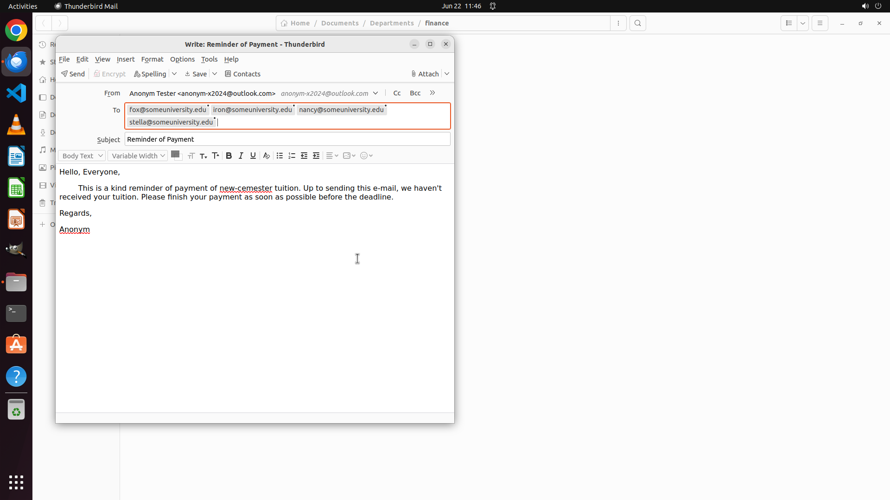

# I've drafted an e-mail reminder for those who haven't paid tuition. Please help me to check out thei…

[← Multi-app Workflows](../README.md) · [← Showcase](../../README.md)

## Task

> I've drafted an e-mail reminder for those who haven't paid tuition. Please help me to check out their e-mails from the payment record and add to the receiver field.

## Final state

## Artifacts

- [Trajectory](traj.jsonl) — per-step actions, reasoning, and screenshots
- [Runtime log](runtime.log)
- [Task definition](task.json) — original OSWorld task config
- Step screenshots: `step_*.png` in this folder

Task ID: `f5c13cdd-205c-4719-a562-348ae5cd1d91` · Domain: `multi_apps` · Source: `authors`
