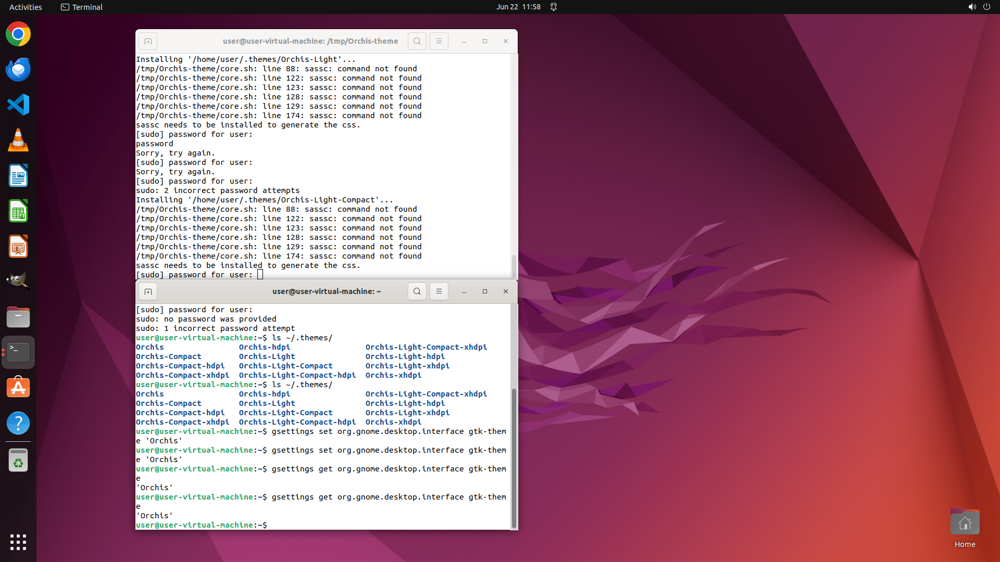

# Help me to install Orchis theme from gnome-look.org and change to it for my GNOME desktop.

[← Multi-app Workflows](../README.md) · [← Showcase](../../README.md)

## Task

> Help me to install Orchis theme from gnome-look.org and change to it for my GNOME desktop.

## Final state

## Artifacts

- [Trajectory](traj.jsonl) — per-step actions, reasoning, and screenshots
- [Runtime log](runtime.log)
- [Task definition](task.json) — original OSWorld task config
- Step screenshots: `step_*.png` in this folder

Task ID: `f8369178-fafe-40c2-adc4-b9b08a125456` · Domain: `multi_apps` · Source: `https://itsfoss.com/install-switch-themes-gnome-shell`
