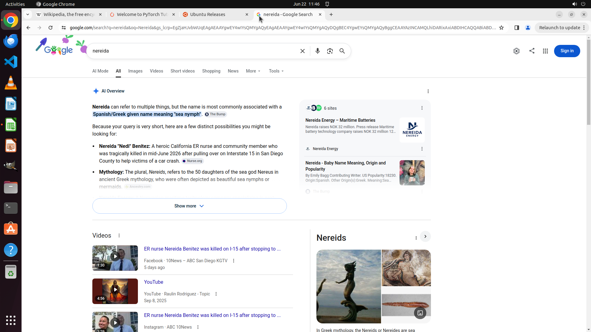

# Could you help me copy the data in Cell B6 in this Libreoffice Calc file and search it in the Chrome…

[← Multi-app Workflows](../README.md) · [← Showcase](../../README.md)

## Task

> Could you help me copy the data in Cell B6 in this Libreoffice Calc file and search it in the Chrome browser.

## Final state

## Artifacts

- [Trajectory](traj.jsonl) — per-step actions, reasoning, and screenshots
- [Runtime log](runtime.log)
- [Task definition](task.json) — original OSWorld task config
- Step screenshots: `step_*.png` in this folder

Task ID: `f8cfa149-d1c1-4215-8dac-4a0932bad3c2` · Domain: `multi_apps` · Source: `https://superuser.com/questions/1803088/libreoffice-calc-clears-clipboard`
