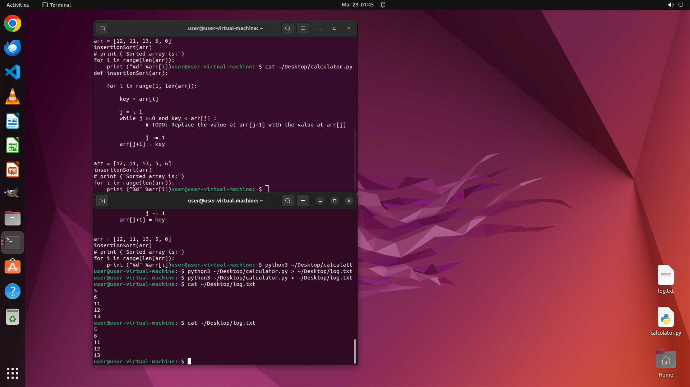

# Please complete the code and retrieve the output from the Python script 'calculator.py' located on t…

[← Multi-app Workflows](../README.md) · [← Showcase](../../README.md)

## Task

> Please complete the code and retrieve the output from the Python script 'calculator.py' located on the desktop and save it as 'log.txt' in the same directory as the Python file.

## Final state

## Artifacts

- [▶ Screen recording](recording.mp4) — full agent run
- [Trajectory](traj.jsonl) — per-step actions, reasoning, and screenshots
- [Runtime log](runtime.log)
- [Task definition](task.json) — original OSWorld task config
- Step screenshots: `step_*.png` in this folder

Task ID: `f918266a-b3e0-4914-865d-4faa564f1aef` · Domain: `multi_apps` · Source: `GAIA`
