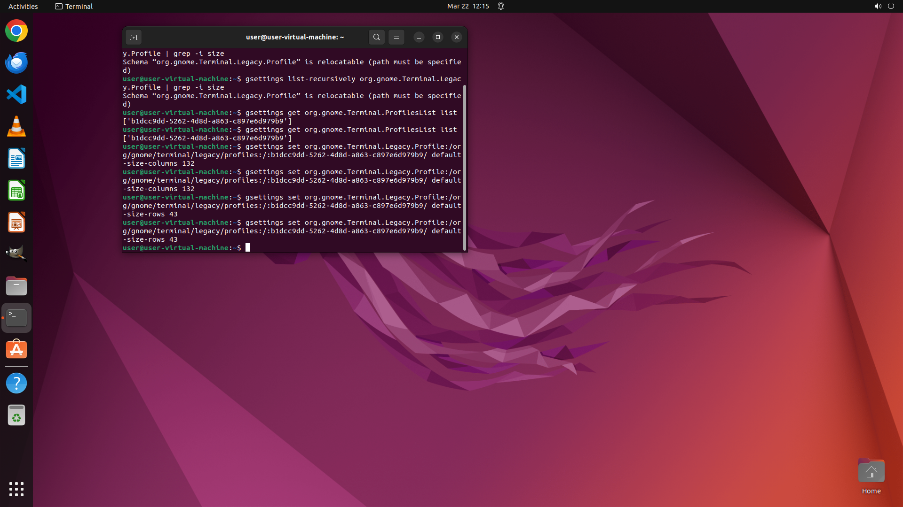

# I click in terminal: terminal->132x43 to change terminal size but after each reboot terminal size is…

[← Operating System](../README.md) · [← Showcase](../../README.md)

## Task

> I click in terminal: terminal->132x43 to change terminal size but after each reboot terminal size is set to default setting and I have to change it again. Help me set it permanently

## Final state

## Artifacts

- [▶ Screen recording](recording.mp4) — full agent run
- [Trajectory](traj.jsonl) — per-step actions, reasoning, and screenshots
- [Runtime log](runtime.log)
- [Task definition](task.json) — original OSWorld task config
- Step screenshots: `step_*.png` in this folder

Task ID: `13584542-872b-42d8-b299-866967b5c3ef` · Domain: `os` · Source: `https://superuser.com/questions/72176/linux-set-default-terminal-size-and-screen-position`
