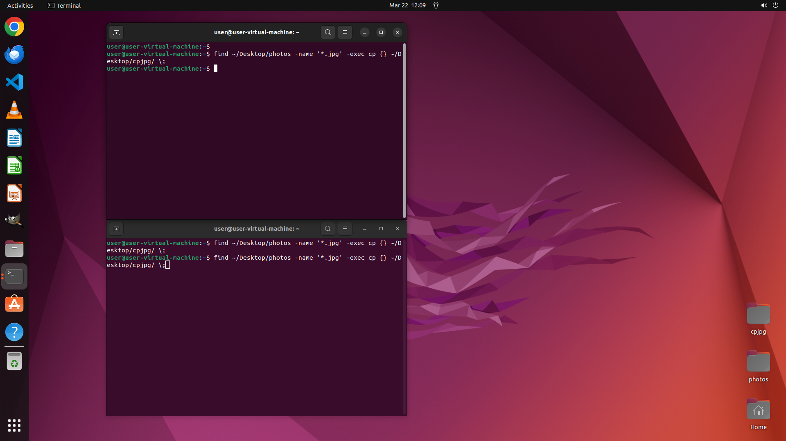

# Recursively go through the folders of the 'photos' directory and copy any .jpg files found into anot…

[← Operating System](../README.md) · [← Showcase](../../README.md)

## Task

> Recursively go through the folders of the 'photos' directory and copy any .jpg files found into another directory named 'cpjpg'.

## Final state

## Artifacts

- [Trajectory](traj.jsonl) — per-step actions, reasoning, and screenshots
- [Runtime log](runtime.log)
- [Task definition](task.json) — original OSWorld task config
- Step screenshots: `step_*.png` in this folder

Task ID: `23393935-50c7-4a86-aeea-2b78fd089c5c` · Domain: `os` · Source: `https://superuser.com/questions/91307/copying-only-jpg-from-a-directory-structure-to-another-location-linux`
