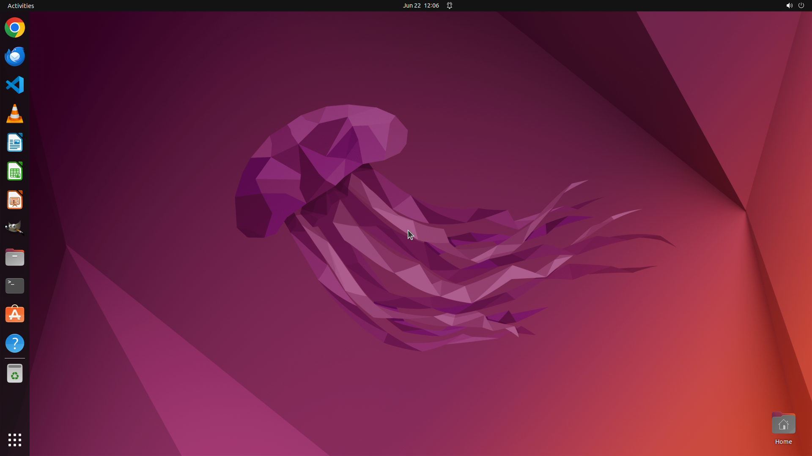

# The volume of my system is too small. Can you help me turn up to the max volume?

[← Operating System](../README.md) · [← Showcase](../../README.md)

## Task

> The volume of my system is too small. Can you help me turn up to the max volume?

## Final state

## Artifacts

- [Trajectory](traj.jsonl) — per-step actions, reasoning, and screenshots
- [Runtime log](runtime.log)
- [Task definition](task.json) — original OSWorld task config
- Step screenshots: `step_*.png` in this folder

Task ID: `28cc3b7e-b194-4bc9-8353-d04c0f4d56d2` · Domain: `os` · Source: `https://help.ubuntu.com/lts/ubuntu-help/sound-volume.html.en`
