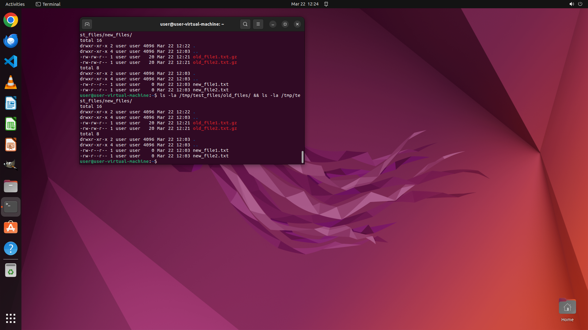

# Compress all files under "/tmp/test_files" that were last modified 30 days ago and put them in "/tmp…

[← Operating System](../README.md) · [← Showcase](../../README.md)

## Task

> Compress all files under "/tmp/test_files" that were last modified 30 days ago and put them in "/tmp/test_files/old_files". Move all other files to "/tmp/test_files/new_files.

## Final state

## Artifacts

- [▶ Screen recording](recording.mp4) — full agent run
- [Trajectory](traj.jsonl) — per-step actions, reasoning, and screenshots
- [Runtime log](runtime.log)
- [Task definition](task.json) — original OSWorld task config
- Step screenshots: `step_*.png` in this folder

Task ID: `37887e8c-da15-4192-923c-08fa390a176d` · Domain: `os` · Source: `NL2Bash`
