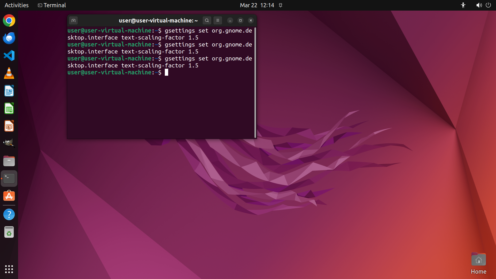

# My glasses are broken, and I'm having trouble seeing small things clearly. Could you help me enlarge…

[← Operating System](../README.md) · [← Showcase](../../README.md)

## Task

> My glasses are broken, and I'm having trouble seeing small things clearly. Could you help me enlarge the text on my screen so it's easier to read?

## Final state

## Artifacts

- [▶ Screen recording](recording.mp4) — full agent run
- [Trajectory](traj.jsonl) — per-step actions, reasoning, and screenshots
- [Runtime log](runtime.log)
- [Task definition](task.json) — original OSWorld task config
- Step screenshots: `step_*.png` in this folder

Task ID: `3ce045a0-877b-42aa-8d2c-b4a863336ab8` · Domain: `os` · Source: `https://help.ubuntu.com/lts/ubuntu-help/a11y-font-size.html.en`
