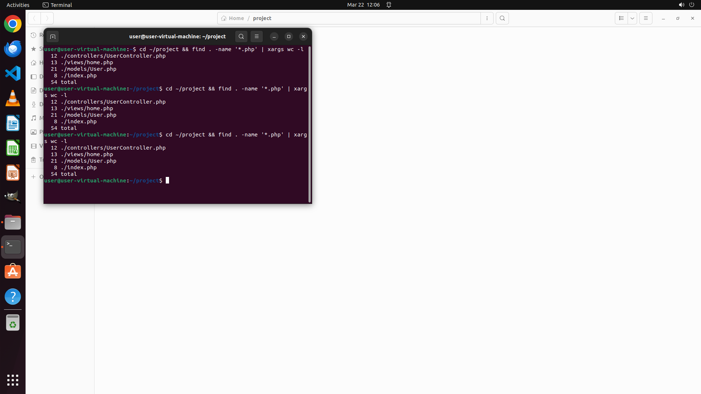

# Use terminal command to count all the lines of all php files in current directory recursively, show …

[← Operating System](../README.md) · [← Showcase](../../README.md)

## Task

> Use terminal command to count all the lines of all php files in current directory recursively, show the result on the terminal

## Final state

## Artifacts

- [▶ Screen recording](recording.mp4) — full agent run
- [Trajectory](traj.jsonl) — per-step actions, reasoning, and screenshots
- [Runtime log](runtime.log)
- [Task definition](task.json) — original OSWorld task config
- Step screenshots: `step_*.png` in this folder

Task ID: `4127319a-8b79-4410-b58a-7a151e15f3d7` · Domain: `os` · Source: `NL2Bash`
