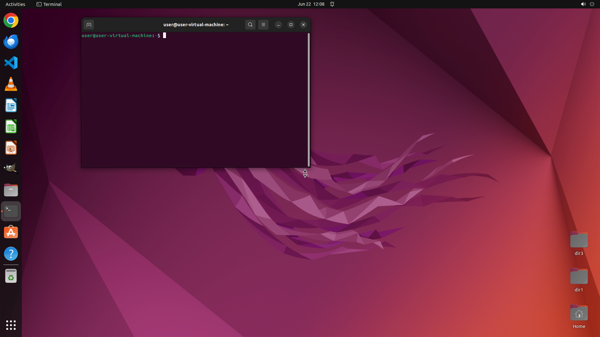

# Copy directory hierarchy from "$sourceDir" to "$targetDir"

[← Operating System](../README.md) · [← Showcase](../../README.md)

## Task

> Copy directory hierarchy from "$sourceDir" to "$targetDir"

## Final state

## Artifacts

- [Trajectory](traj.jsonl) — per-step actions, reasoning, and screenshots
- [Runtime log](runtime.log)
- [Task definition](task.json) — original OSWorld task config
- Step screenshots: `step_*.png` in this folder

Task ID: `4783cc41-c03c-4e1b-89b4-50658f642bd5` · Domain: `os` · Source: `NL2Bash`
