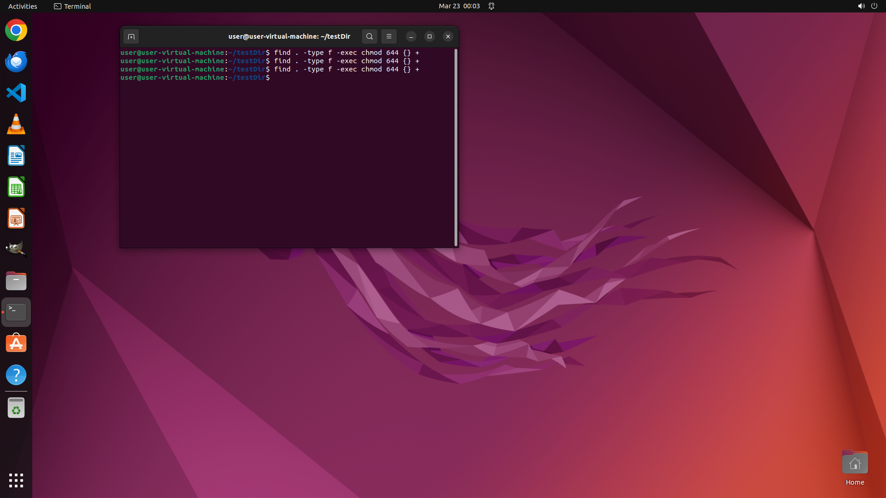

# Change the permission of all regular files under current directory tree to 644

[← Operating System](../README.md) · [← Showcase](../../README.md)

## Task

> Change the permission of all regular files under current directory tree to 644

## Final state

## Artifacts

- [▶ Screen recording](recording.mp4) — full agent run
- [Trajectory](traj.jsonl) — per-step actions, reasoning, and screenshots
- [Runtime log](runtime.log)
- [Task definition](task.json) — original OSWorld task config
- Step screenshots: `step_*.png` in this folder

Task ID: `4d117223-a354-47fb-8b45-62ab1390a95f` · Domain: `os` · Source: `NL2Bash`
