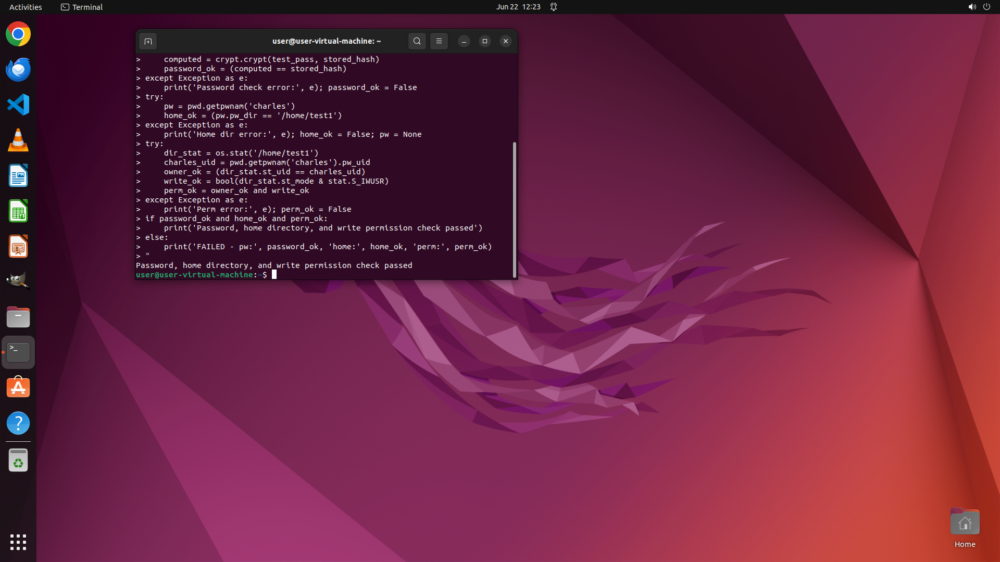

# Please create an SSH user named "charles" with password "Ex@mpleP@55w0rd!" on Ubuntu who is only all…

[← Operating System](../README.md) · [← Showcase](../../README.md)

## Task

> Please create an SSH user named "charles" with password "Ex@mpleP@55w0rd!" on Ubuntu who is only allowed to access the folder "/home/test1".

## Final state

## Artifacts

- [Trajectory](traj.jsonl) — per-step actions, reasoning, and screenshots
- [Runtime log](runtime.log)
- [Task definition](task.json) — original OSWorld task config
- Step screenshots: `step_*.png` in this folder

Task ID: `5812b315-e7bd-4265-b51f-863c02174c28` · Domain: `os` · Source: `https://superuser.com/questions/149404/create-an-ssh-user-who-only-has-permission-to-access-specific-folders`
