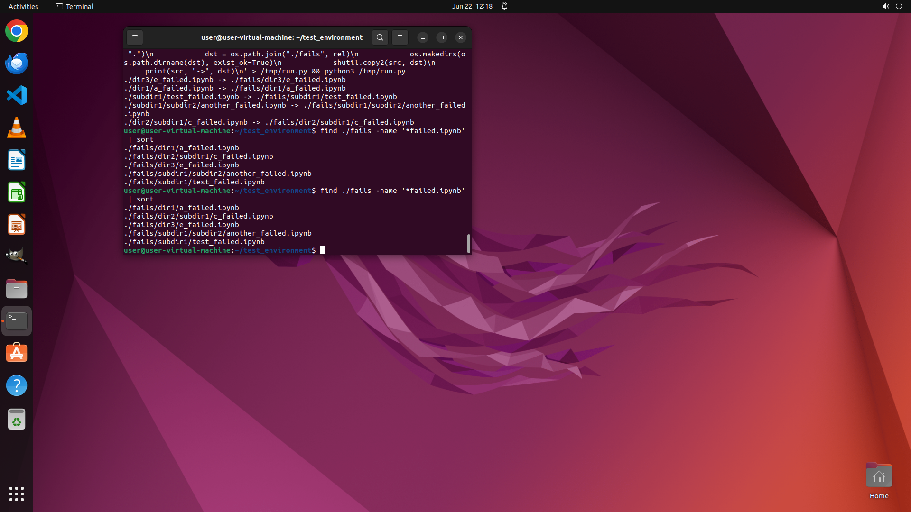

# Copy all files matching "*failed.ipynb" in the current directory tree to "./fails" preserving the di…

[← Operating System](../README.md) · [← Showcase](../../README.md)

## Task

> Copy all files matching "*failed.ipynb" in the current directory tree to "./fails" preserving the directory hierarchy

## Final state

## Artifacts

- [Trajectory](traj.jsonl) — per-step actions, reasoning, and screenshots
- [Runtime log](runtime.log)
- [Task definition](task.json) — original OSWorld task config
- Step screenshots: `step_*.png` in this folder

Task ID: `5c1075ca-bb34-46a3-a7a0-029bd7463e79` · Domain: `os` · Source: `NL2Bash`
