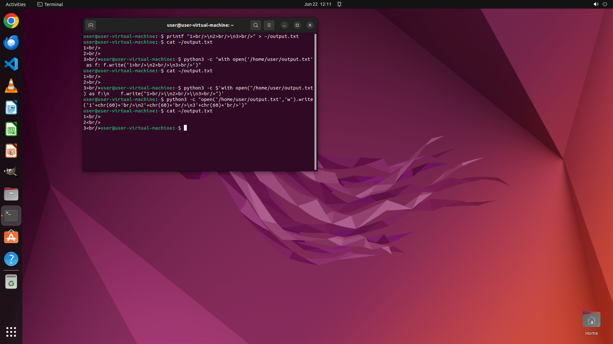

# Append " " to the end of each line in "1\n2\n3" and save in output.txt

[← Operating System](../README.md) · [← Showcase](../../README.md)

## Task

> Append " " to the end of each line in "1\n2\n3" and save in output.txt

## Final state

## Artifacts

- [Trajectory](traj.jsonl) — per-step actions, reasoning, and screenshots
- [Runtime log](runtime.log)
- [Task definition](task.json) — original OSWorld task config
- Step screenshots: `step_*.png` in this folder

Task ID: `5ced85fc-fa1a-4217-95fd-0fb530545ce2` · Domain: `os` · Source: `NL2Bash`
