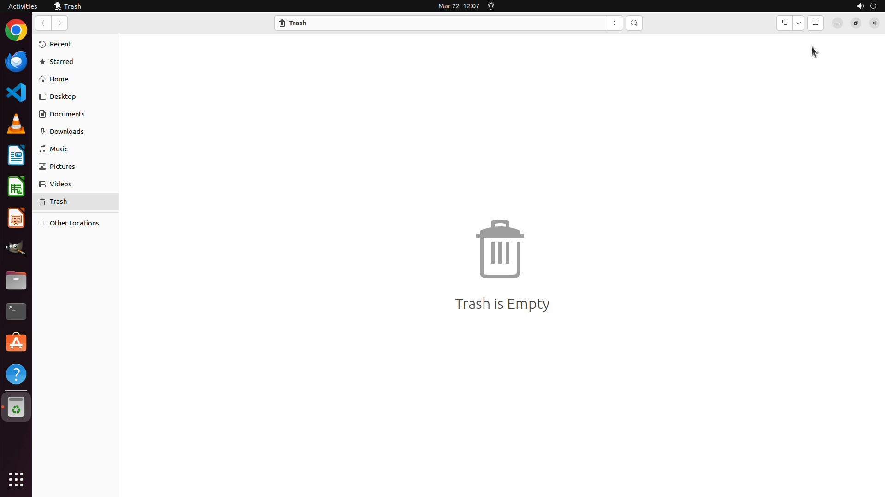

# I am currently using an Ubuntu system, and I have wrongly deleted a poster of party night. Could you…

[← Operating System](../README.md) · [← Showcase](../../README.md)

## Task

> I am currently using an Ubuntu system, and I have wrongly deleted a poster of party night. Could you help me recover it from the Trash?

## Final state

## Artifacts

- [▶ Screen recording](recording.mp4) — full agent run
- [Trajectory](traj.jsonl) — per-step actions, reasoning, and screenshots
- [Runtime log](runtime.log)
- [Task definition](task.json) — original OSWorld task config
- Step screenshots: `step_*.png` in this folder

Task ID: `5ea617a3-0e86-4ba6-aab2-dac9aa2e8d57` · Domain: `os` · Source: `https://help.ubuntu.com/lts/ubuntu-help/files-recover.html.en`
