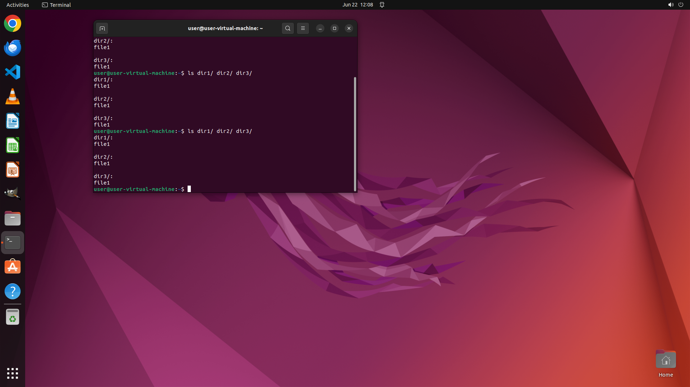

# Copies file 'file1' to each of directories 'dir1', 'dir2', 'dir3'.

[← Operating System](../README.md) · [← Showcase](../../README.md)

## Task

> Copies file 'file1' to each of directories 'dir1', 'dir2', 'dir3'.

## Final state

## Artifacts

- [Trajectory](traj.jsonl) — per-step actions, reasoning, and screenshots
- [Runtime log](runtime.log)
- [Task definition](task.json) — original OSWorld task config
- Step screenshots: `step_*.png` in this folder

Task ID: `6f56bf42-85b8-4fbb-8e06-6c44960184ba` · Domain: `os` · Source: `NL2Bash`
