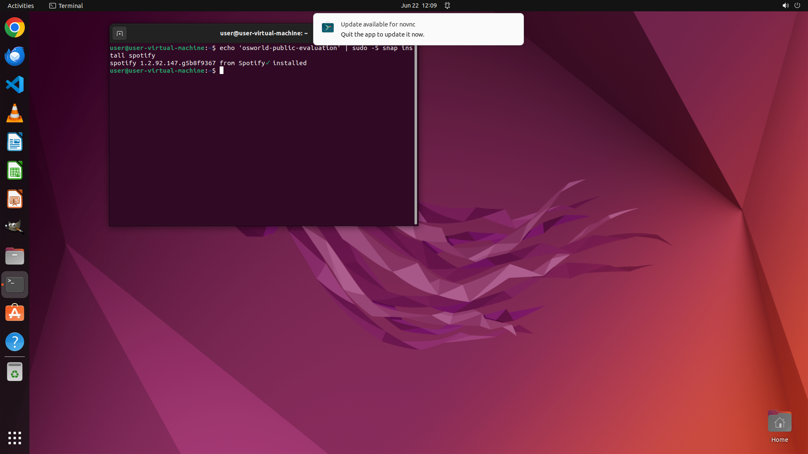

# I want to install Spotify on my current system. Could you please help me?

[← Operating System](../README.md) · [← Showcase](../../README.md)

## Task

> I want to install Spotify on my current system. Could you please help me?

## Final state

## Artifacts

- [Trajectory](traj.jsonl) — per-step actions, reasoning, and screenshots
- [Runtime log](runtime.log)
- [Task definition](task.json) — original OSWorld task config
- Step screenshots: `step_*.png` in this folder

Task ID: `94d95f96-9699-4208-98ba-3c3119edf9c2` · Domain: `os` · Source: `https://help.ubuntu.com/lts/ubuntu-help/addremove-install.html.en`
