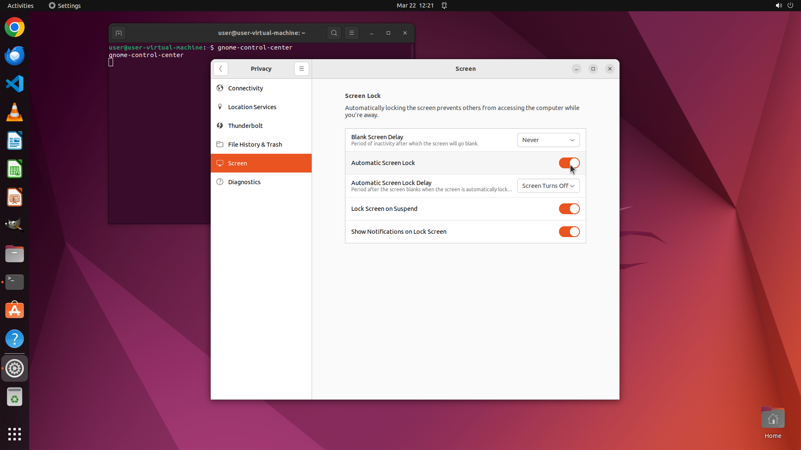

# I want to have my computer automatically locked after I leaved. Can you help me?

[← Operating System](../README.md) · [← Showcase](../../README.md)

## Task

> I want to have my computer automatically locked after I leaved. Can you help me?

## Final state

## Artifacts

- [▶ Screen recording](recording.mp4) — full agent run
- [Trajectory](traj.jsonl) — per-step actions, reasoning, and screenshots
- [Runtime log](runtime.log)
- [Task definition](task.json) — original OSWorld task config
- Step screenshots: `step_*.png` in this folder

Task ID: `a4d98375-215b-4a4d-aee9-3d4370fccc41` · Domain: `os` · Source: `https://help.ubuntu.com/lts/ubuntu-help/privacy-screen-lock.html.en`
