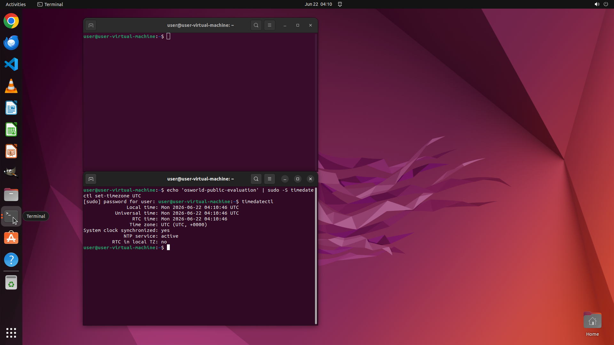

# I want to set my current time zone to UTC+0. Can you help me?

[← Operating System](../README.md) · [← Showcase](../../README.md)

## Task

> I want to set my current time zone to UTC+0. Can you help me?

## Final state

## Artifacts

- [Trajectory](traj.jsonl) — per-step actions, reasoning, and screenshots
- [Runtime log](runtime.log)
- [Task definition](task.json) — original OSWorld task config
- Step screenshots: `step_*.png` in this folder

Task ID: `b6781586-6346-41cd-935a-a6b1487918fc` · Domain: `os` · Source: `https://help.ubuntu.com/lts/ubuntu-help/clock-timezone.html.en`
