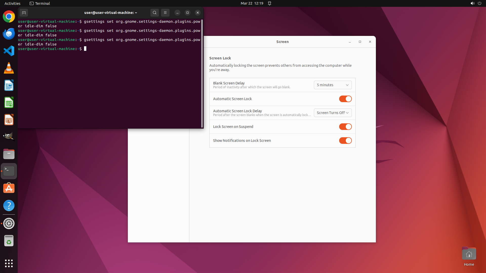

# Could you set the 'Dim screen when inactive' to off in setting?

[← Operating System](../README.md) · [← Showcase](../../README.md)

## Task

> Could you set the 'Dim screen when inactive' to off in setting?

## Final state

## Artifacts

- [▶ Screen recording](recording.mp4) — full agent run
- [Trajectory](traj.jsonl) — per-step actions, reasoning, and screenshots
- [Runtime log](runtime.log)
- [Task definition](task.json) — original OSWorld task config
- Step screenshots: `step_*.png` in this folder

Task ID: `bedcedc4-4d72-425e-ad62-21960b11fe0d` · Domain: `os` · Source: `https://www.youtube.com/watch?v=D4WyNjt_hbQ&t=2s`
