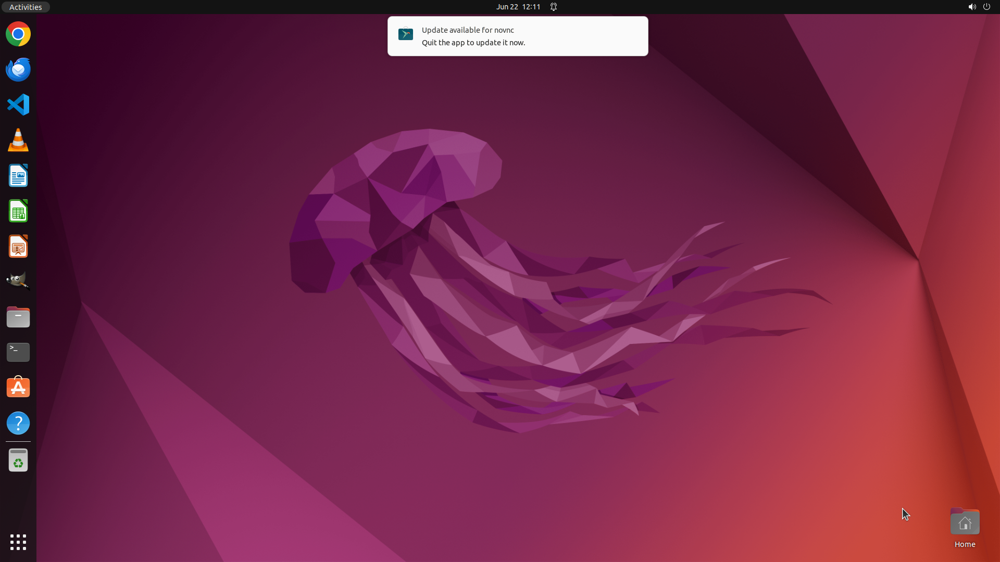

# Please set the default Python version to Python4 on my Ubuntu system.

[← Operating System](../README.md) · [← Showcase](../../README.md)

## Task

> Please set the default Python version to Python4 on my Ubuntu system.

## Final state

## Artifacts

- [Trajectory](traj.jsonl) — per-step actions, reasoning, and screenshots
- [Runtime log](runtime.log)
- [Task definition](task.json) — original OSWorld task config
- Step screenshots: `step_*.png` in this folder

Task ID: `c288e301-e626-4b98-a1ab-159dcb162af5` · Domain: `os` · Source: `https://stackoverflow.com/questions/41986507/unable-to-set-default-python-version-to-python3-in-ubuntu`
