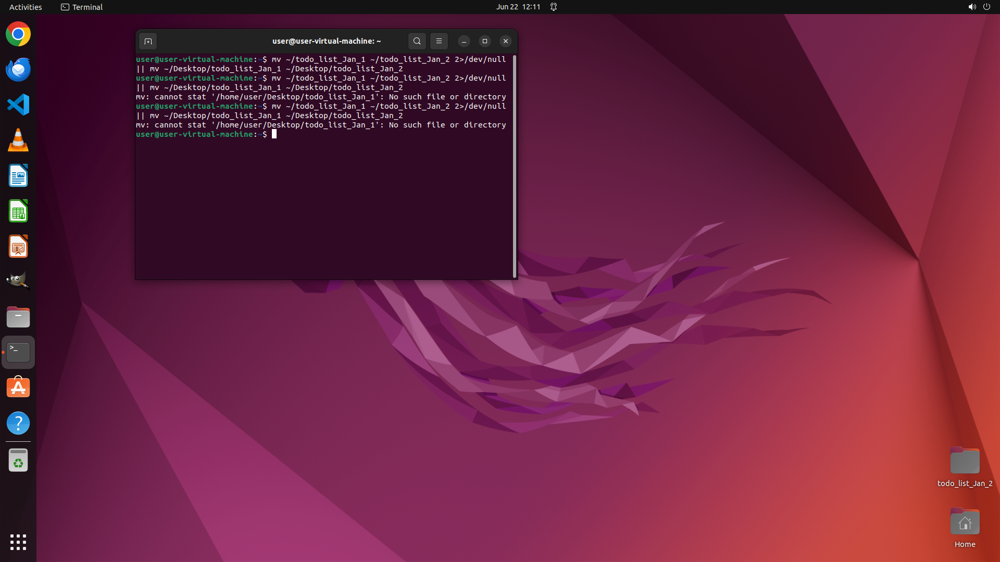

# I have a directory named "todo_list_Jan_1". Can you help me change its name into "todo_list_Jan_2"?

[← Operating System](../README.md) · [← Showcase](../../README.md)

## Task

> I have a directory named "todo_list_Jan_1". Can you help me change its name into "todo_list_Jan_2"?

## Final state

## Artifacts

- [Trajectory](traj.jsonl) — per-step actions, reasoning, and screenshots
- [Runtime log](runtime.log)
- [Task definition](task.json) — original OSWorld task config
- Step screenshots: `step_*.png` in this folder

Task ID: `e0df059f-28a6-4169-924f-b9623e7184cc` · Domain: `os` · Source: `https://help.ubuntu.com/lts/ubuntu-help/files-rename.html.en`
