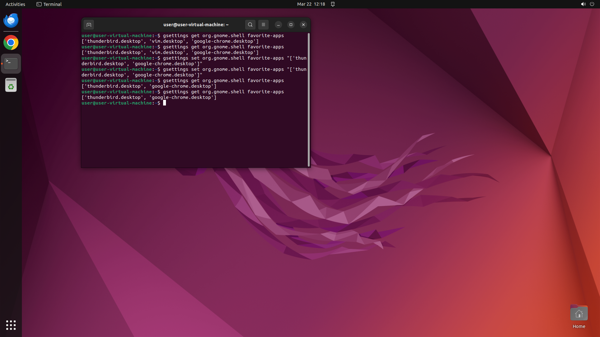

# Can you remove vim from favorite app in 'favorites'?

[← Operating System](../README.md) · [← Showcase](../../README.md)

## Task

> Can you remove vim from favorite app in 'favorites'?

## Final state

## Artifacts

- [▶ Screen recording](recording.mp4) — full agent run
- [Trajectory](traj.jsonl) — per-step actions, reasoning, and screenshots
- [Runtime log](runtime.log)
- [Task definition](task.json) — original OSWorld task config
- Step screenshots: `step_*.png` in this folder

Task ID: `ec4e3f68-9ea4-4c18-a5c9-69f89d1178b3` · Domain: `os` · Source: `https://www.youtube.com/watch?v=D4WyNjt_hbQ&t=2s`
