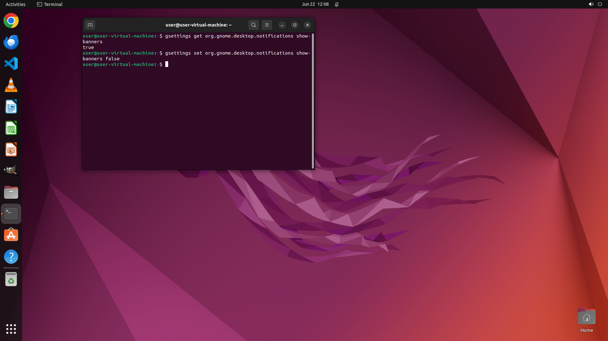

# I am currently working on a ubuntu system but I do not want the notifications to bother me. Can you …

[← Operating System](../README.md) · [← Showcase](../../README.md)

## Task

> I am currently working on a ubuntu system but I do not want the notifications to bother me. Can you help me to switch to 'Do not disturb mode'?

## Final state

## Artifacts

- [Trajectory](traj.jsonl) — per-step actions, reasoning, and screenshots
- [Runtime log](runtime.log)
- [Task definition](task.json) — original OSWorld task config
- Step screenshots: `step_*.png` in this folder

Task ID: `f9be0997-4b7c-45c5-b05c-4612b44a6118` · Domain: `os` · Source: `https://help.ubuntu.com/lts/ubuntu-help/shell-notifications.html.en`
