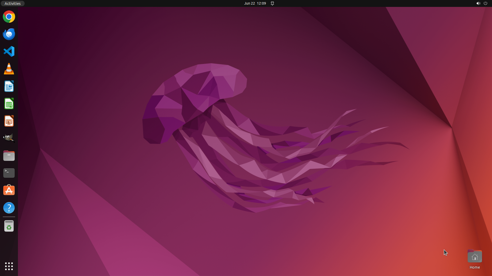

# I want to see the battery percentage. Can you help me display it on my screen?

[← Operating System](../README.md) · [← Showcase](../../README.md)

## Task

> I want to see the battery percentage. Can you help me display it on my screen?

## Final state

## Artifacts

- [Trajectory](traj.jsonl) — per-step actions, reasoning, and screenshots
- [Runtime log](runtime.log)
- [Task definition](task.json) — original OSWorld task config
- Step screenshots: `step_*.png` in this folder

Task ID: `fe41f596-a71b-4c2f-9b2f-9dcd40b568c3` · Domain: `os` · Source: `https://help.ubuntu.com/lts/ubuntu-help/power-percentage.html.en`
