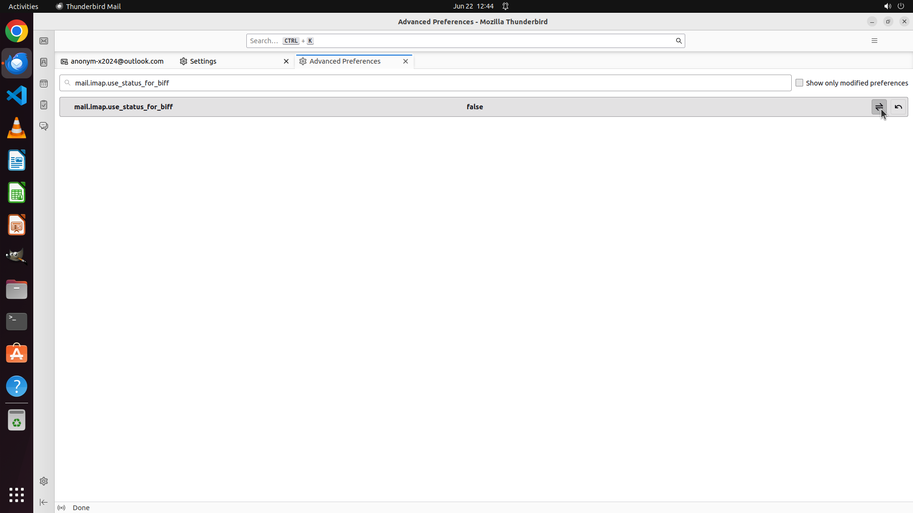

# Thunderbird's message filters seem to only fire on Inbox automatically. If you want to filter on sub…

[← Thunderbird](../README.md) · [← Showcase](../../README.md)

## Task

> Thunderbird's message filters seem to only fire on Inbox automatically. If you want to filter on subfolders, you'd have to start this filter manually. I am wondering if the filter can be applied automatically. Could you help me apply automatic message filters to subfolders

## Final state

## Artifacts

- [Trajectory](traj.jsonl) — per-step actions, reasoning, and screenshots
- [Runtime log](runtime.log)
- [Task definition](task.json) — original OSWorld task config
- Step screenshots: `step_*.png` in this folder

Task ID: `08c73485-7c6d-4681-999d-919f5c32dcfa` · Domain: `thunderbird` · Source: `https://superuser.com/questions/544480/how-to-apply-automatic-message-filters-to-subfolders-too?noredirect=1&lq=1`
