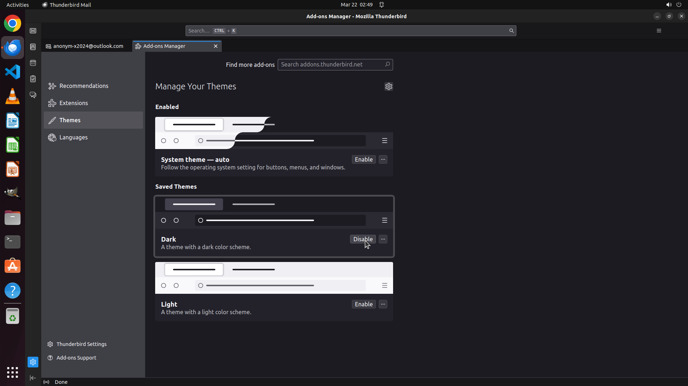

# Considering I work late into the night and use Thunderbird frequently, I find that a full dark mode …

[← Thunderbird](../README.md) · [← Showcase](../../README.md)

## Task

> Considering I work late into the night and use Thunderbird frequently, I find that a full dark mode would be easier on my eyes during those hours. Can you help me enable a complete dark mode in Thunderbird?

## Final state

## Artifacts

- [▶ Screen recording](recording.mp4) — full agent run
- [Trajectory](traj.jsonl) — per-step actions, reasoning, and screenshots
- [Runtime log](runtime.log)
- [Task definition](task.json) — original OSWorld task config
- Step screenshots: `step_*.png` in this folder

Task ID: `10a730d5-d414-4b40-b479-684bed1ae522` · Domain: `thunderbird` · Source: `https://superuser.com/questions/1757333/how-can-i-view-thunderbird-in-full-dark-mode`
