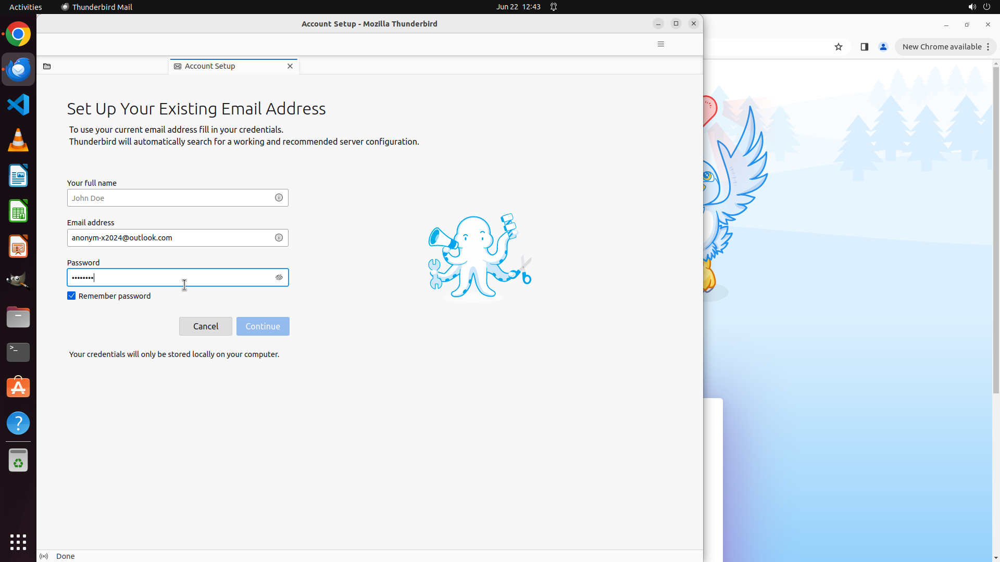

# Help me access my outlook account with address "anonym-x2024@outlook.com" and password 'password' (w…

[← Thunderbird](../README.md) · [← Showcase](../../README.md)

## Task

> Help me access my outlook account with address "anonym-x2024@outlook.com" and password 'password' (without ') in Thunderbird. Just fill in the information and stay on that page. I will check it manually later.

## Final state

## Artifacts

- [Trajectory](traj.jsonl) — per-step actions, reasoning, and screenshots
- [Runtime log](runtime.log)
- [Task definition](task.json) — original OSWorld task config
- Step screenshots: `step_*.png` in this folder

Task ID: `15c3b339-88f7-4a86-ab16-e71c58dcb01e` · Domain: `thunderbird` · Source: `https://www.wikihow.com/Access-Gmail-With-Mozilla-Thunderbird`
