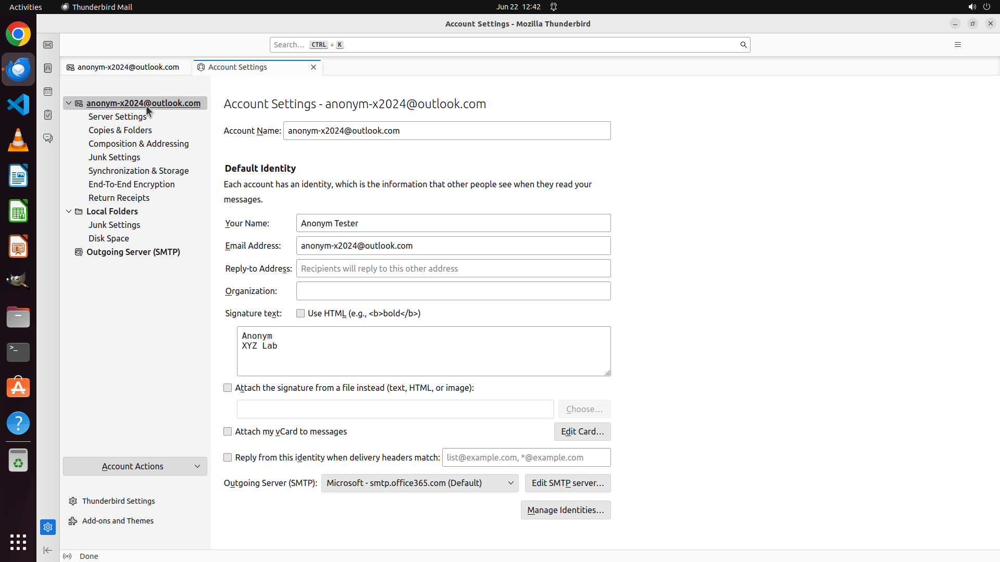

# Set up a plain text signature for my email account in Thunderbird. The first line is my name "Anonym…

[← Thunderbird](../README.md) · [← Showcase](../../README.md)

## Task

> Set up a plain text signature for my email account in Thunderbird. The first line is my name "Anonym" and the second line is my affiliation "XYZ Lab".

## Final state

## Artifacts

- [Trajectory](traj.jsonl) — per-step actions, reasoning, and screenshots
- [Runtime log](runtime.log)
- [Task definition](task.json) — original OSWorld task config
- Step screenshots: `step_*.png` in this folder

Task ID: `3f28fe4f-5d9d-4994-a456-efd78cfae1a3` · Domain: `thunderbird` · Source: `https://www.adsigner.com/user-manual/signatures/setup-email-client-thunderbird/#:~:text=is%20probably%20hidden.-,Right%20click%20on%20the%20empty%20space%20at%20the%20top%20of,signature%20from%20a%20file%20instead.`
