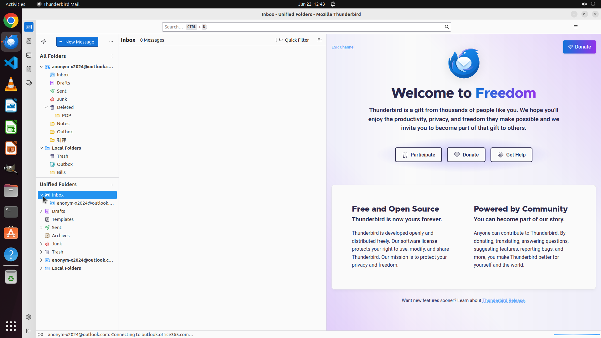

# I've got a bunch of email accounts in Thunderbird, and it's a hassle to check them one by one. Can y…

[← Thunderbird](../README.md) · [← Showcase](../../README.md)

## Task

> I've got a bunch of email accounts in Thunderbird, and it's a hassle to check them one by one. Can you show me how to set up a unified inbox so I can see all my emails in one place?

## Final state

## Artifacts

- [Trajectory](traj.jsonl) — per-step actions, reasoning, and screenshots
- [Runtime log](runtime.log)
- [Task definition](task.json) — original OSWorld task config
- Step screenshots: `step_*.png` in this folder

Task ID: `3f49d2cc-f400-4e7d-90cc-9b18e401cc31` · Domain: `thunderbird` · Source: `https://www.reddit.com/r/Thunderbird/comments/182dg5p/unified_inbox_howto/`
