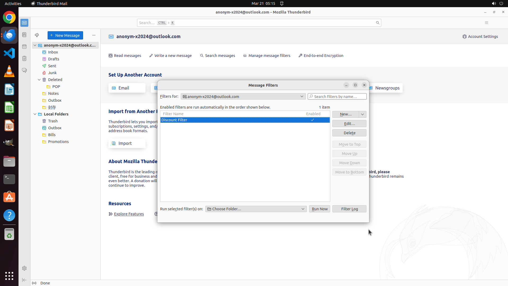

# Create a local folder called "Promotions" and create a filter to auto move the inbox emails whose su…

[← Thunderbird](../README.md) · [← Showcase](../../README.md)

## Task

> Create a local folder called "Promotions" and create a filter to auto move the inbox emails whose subject contains “discount” to the new folder

## Final state

## Artifacts

- [▶ Screen recording](recording.mp4) — full agent run
- [Trajectory](traj.jsonl) — per-step actions, reasoning, and screenshots
- [Runtime log](runtime.log)
- [Task definition](task.json) — original OSWorld task config
- Step screenshots: `step_*.png` in this folder

Task ID: `5203d847-2572-4150-912a-03f062254390` · Domain: `thunderbird` · Source: `https://support.mozilla.org/en-US/kb/organize-your-messages-using-filters`
