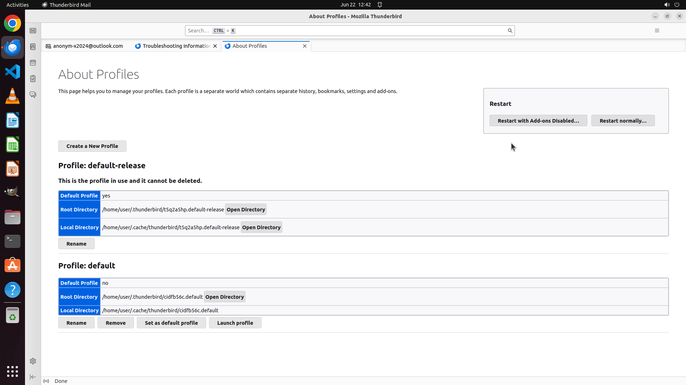

# Could you help me open up the profile management tabpage in Thunderbird? I want the profile manageme…

[← Thunderbird](../README.md) · [← Showcase](../../README.md)

## Task

> Could you help me open up the profile management tabpage in Thunderbird? I want the profile management tabpage inside Thunderbird app, but not the profile chooser dialog during app launch.

## Final state

## Artifacts

- [Trajectory](traj.jsonl) — per-step actions, reasoning, and screenshots
- [Runtime log](runtime.log)
- [Task definition](task.json) — original OSWorld task config
- Step screenshots: `step_*.png` in this folder

Task ID: `7b1e1ff9-bb85-49be-b01d-d6424be18cd0` · Domain: `thunderbird` · Source: `https://www.quora.com/How-do-I-open-a-Thunderbird-profile-manager-utility`
