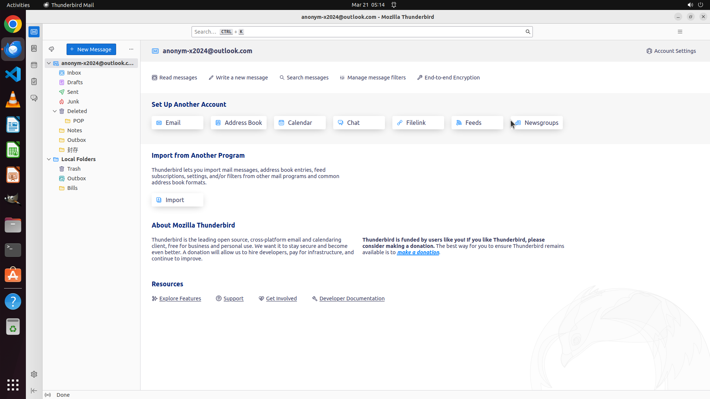

# Set up to forward every email received by anonym-x2024@outlook.com in the future to anonym-x2024@gma…

[← Thunderbird](../README.md) · [← Showcase](../../README.md)

## Task

> Set up to forward every email received by anonym-x2024@outlook.com in the future to anonym-x2024@gmail.com. Please don't touch the online account. Just locally in the Thunderbird!

## Final state

## Artifacts

- [▶ Screen recording](recording.mp4) — full agent run
- [Trajectory](traj.jsonl) — per-step actions, reasoning, and screenshots
- [Runtime log](runtime.log)
- [Task definition](task.json) — original OSWorld task config
- Step screenshots: `step_*.png` in this folder

Task ID: `9b7bc335-06b5-4cd3-9119-1a649c478509` · Domain: `thunderbird` · Source: `https://support.mozilla.org/en-US/questions/1259354`
