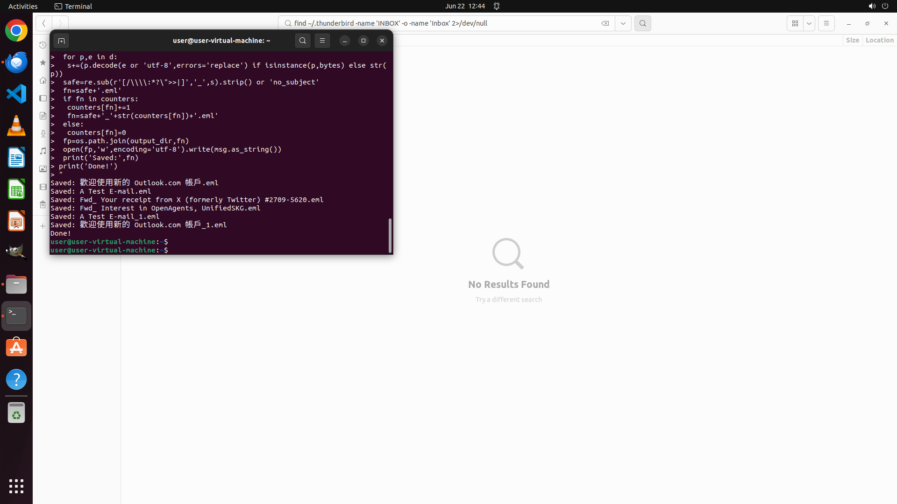

# Could you help me back up all the email files in my inbox to ~/emails.bak? Please save them separate…

[← Thunderbird](../README.md) · [← Showcase](../../README.md)

## Task

> Could you help me back up all the email files in my inbox to ~/emails.bak? Please save them separately in eml format.

## Final state

## Artifacts

- [Trajectory](traj.jsonl) — per-step actions, reasoning, and screenshots
- [Runtime log](runtime.log)
- [Task definition](task.json) — original OSWorld task config
- Step screenshots: `step_*.png` in this folder

Task ID: `9bc3cc16-074a-45ac-9bdc-b2a362e1daf3` · Domain: `thunderbird` · Source: `https://www.quora.com/How-do-I-backup-email-files-in-Mozilla-Thunderbird`
