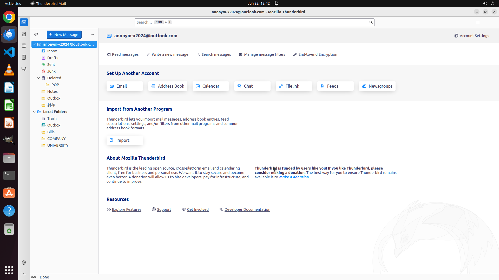

# Create two local folders in Thunderbird for me: COMPANY and UNIVERSITY.

[← Thunderbird](../README.md) · [← Showcase](../../README.md)

## Task

> Create two local folders in Thunderbird for me: COMPANY and UNIVERSITY.

## Final state

## Artifacts

- [Trajectory](traj.jsonl) — per-step actions, reasoning, and screenshots
- [Runtime log](runtime.log)
- [Task definition](task.json) — original OSWorld task config
- Step screenshots: `step_*.png` in this folder

Task ID: `a10b69e1-6034-4a2b-93e1-571d45194f75` · Domain: `thunderbird` · Source: `https://support.mozilla.org/bm/questions/1027435`
