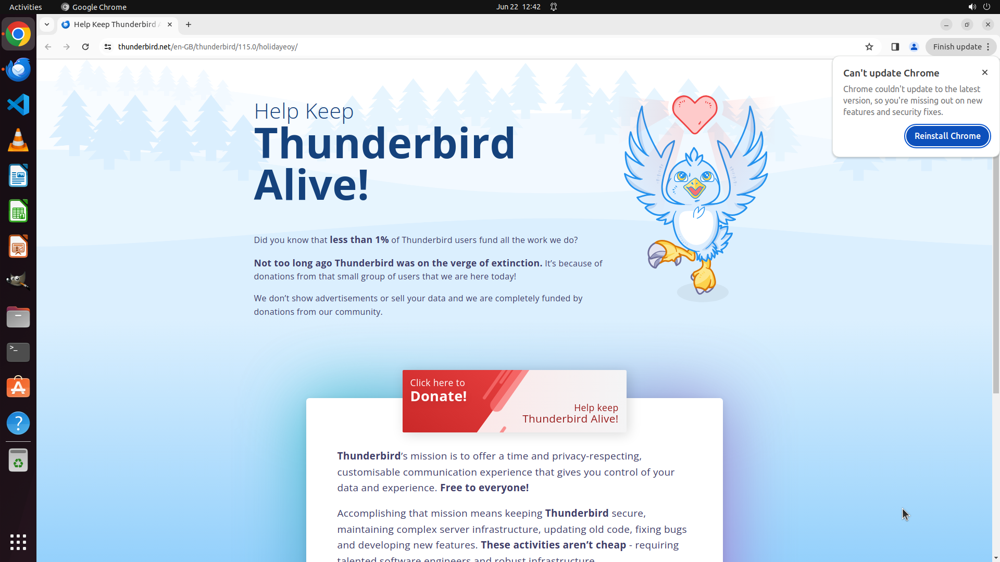

# Due to certain security considerations and the nature of my work, I prefer not to configure an incom…

[← Thunderbird](../README.md) · [← Showcase](../../README.md)

## Task

> Due to certain security considerations and the nature of my work, I prefer not to configure an incoming email service in Thunderbird. However, I still need to send emails. Can you help me set up Thunderbird to send emails from anonym-x2024@outlook.com without configuring its incoming email service?

## Final state

## Artifacts

- [Trajectory](traj.jsonl) — per-step actions, reasoning, and screenshots
- [Runtime log](runtime.log)
- [Task definition](task.json) — original OSWorld task config
- Step screenshots: `step_*.png` in this folder

Task ID: `a1af9f1c-50d5-4bc3-a51e-4d9b425ff638` · Domain: `thunderbird` · Source: `https://superuser.com/questions/1764409/how-to-send-email-with-thunderbird-without-configuring-an-incoming-email-service`
