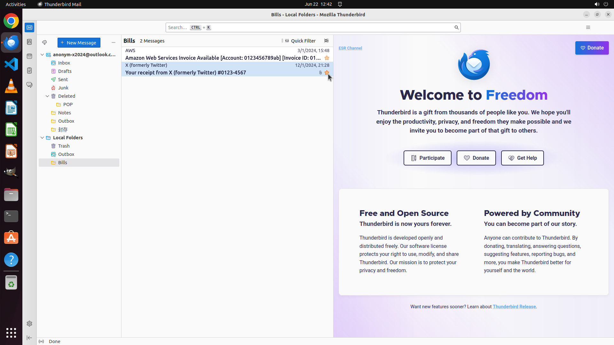

# Add a star to every email in local Bills folder

[← Thunderbird](../README.md) · [← Showcase](../../README.md)

## Task

> Add a star to every email in local Bills folder

## Final state

## Artifacts

- [Trajectory](traj.jsonl) — per-step actions, reasoning, and screenshots
- [Runtime log](runtime.log)
- [Task definition](task.json) — original OSWorld task config
- Step screenshots: `step_*.png` in this folder

Task ID: `dd84e895-72fd-4023-a336-97689ded257c` · Domain: `thunderbird` · Source: `https://support.mozilla.org/en-US/kb/organize-your-messages-using-filters`
