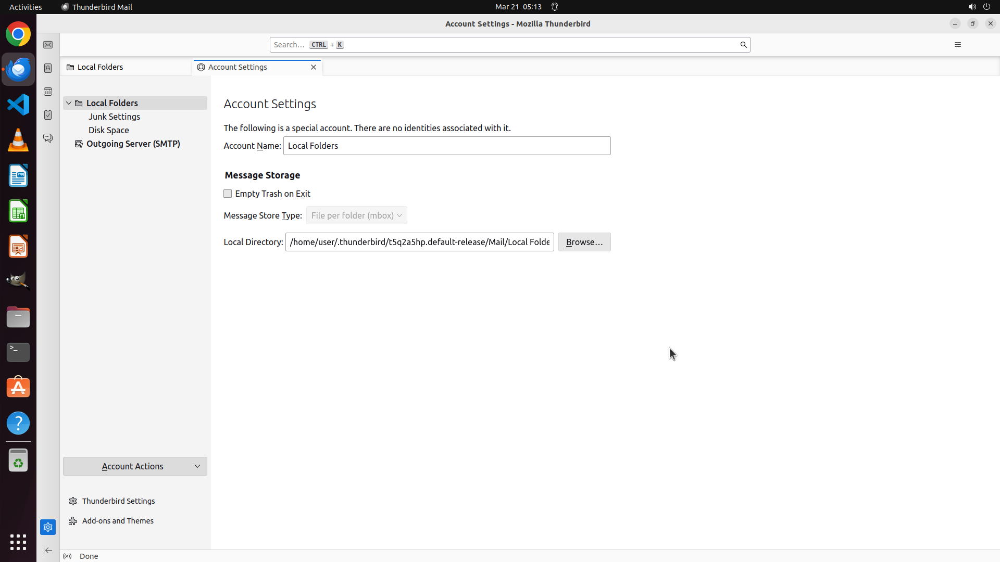

# Help me to remove the account "anonym-x2024@outlook.com"

[← Thunderbird](../README.md) · [← Showcase](../../README.md)

## Task

> Help me to remove the account "anonym-x2024@outlook.com"

## Final state

## Artifacts

- [▶ Screen recording](recording.mp4) — full agent run
- [Trajectory](traj.jsonl) — per-step actions, reasoning, and screenshots
- [Runtime log](runtime.log)
- [Task definition](task.json) — original OSWorld task config
- Step screenshots: `step_*.png` in this folder

Task ID: `dfac9ee8-9bc4-4cdc-b465-4a4bfcd2f397` · Domain: `thunderbird` · Source: `https://www.wikihow.com/Remove-an-Email-Account-from-Thunderbird`
